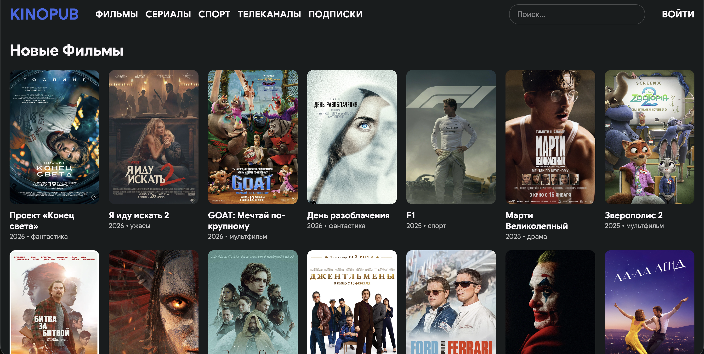
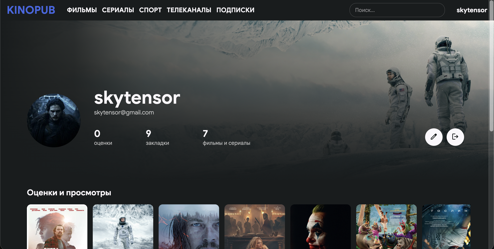
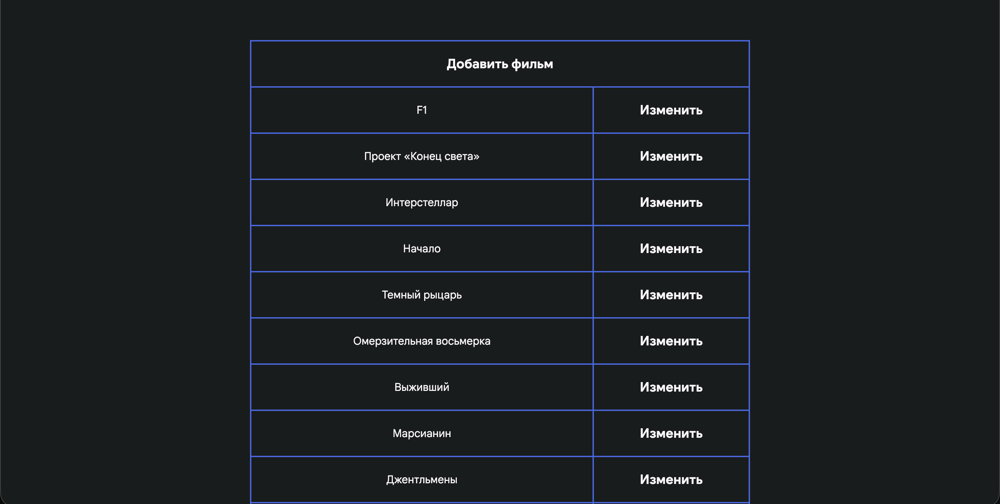
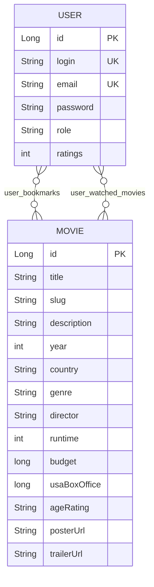

# 🎬 KINOPUB

A full-stack movie catalog web application built with **Java 21** and **Spring Boot 4**. Users can browse and search movies, keep a personal watchlist and a "watched" list, and administrators manage the catalog through a dedicated admin panel.


## Screenshots

| Home | Movie page |
|------|------------|
|  |  |
| **Profile** | **Admin panel** |
|  |  |

> The interface is in Russian.

## Features

**For visitors and users**
- Home page with the latest movies, sorted by release year
- Full catalog with pagination (20 movies per page)
- Search by title (case-insensitive, paginated)
- Movie page with poster, backdrop, trailer and detailed credits: director, screenplay, producer, cinematographer, composer, production designer, editor, budget, US box office, age rating and runtime
- Registration and login with form-based authentication
- **Bookmarks**: save a movie to your list
- **Watched list**: mark a movie as watched
- Profile page with your bookmarks and watched movies

**For administrators**
- Admin panel: list, create, edit and delete movies
- Access is restricted to the `ADMIN` role

**Backend**
- Passwords are hashed with BCrypt
- Server-side validation with Jakarta Validation (registration form and movie creation)
- REST API controller for creating and deleting movies (admin only)
- Schema is generated automatically by Hibernate

## Tech Stack

| Layer       | Technologies                                          |
|-------------|-------------------------------------------------------|
| Language    | Java 21                                               |
| Framework   | Spring Boot 4.0.6, Spring MVC                         |
| Security    | Spring Security, role-based access with method security (`@PreAuthorize`) |
| Persistence | Spring Data JPA (Hibernate), MySQL                    |
| Views       | Thymeleaf, Thymeleaf Spring Security extras, custom CSS |
| Validation  | Spring Boot Starter Validation (Jakarta Validation)   |
| Build       | Maven (Maven Wrapper included)                        |

## Architecture

The project uses a layered MVC architecture:

```
src/main/java/com/project/code
├── config/        Spring Security configuration
├── controller/    Web controllers and the REST controller
├── dto/           Form objects (MovieForm, RegisterForm)
├── mapper/        Mapping between forms and entities
├── model/         JPA entities (Movie, User)
├── repository/    Spring Data JPA repositories
└── service/       UserDetails service for Spring Security
```

```
Browser / API client
        │
        ▼
  Controllers  ──  Thymeleaf views / JSON
        │
        ▼
  Repositories  ──  Spring Data JPA
        │
        ▼
      MySQL
```

### Database schema

Tables are created by Hibernate (`ddl-auto=update`). Bookmarks and watched movies are two many-to-many relations between users and movies.



> The `MOVIE` entity has more fields (tagline, screenplay, producer, composer, etc.); the diagram shows the main ones.

## Getting Started

### Prerequisites

- JDK 21
- MySQL server
- Git

Maven does not need to be installed: the project includes the Maven Wrapper.

### 1. Clone the repository

```bash
git clone https://github.com/skytensor/kinopub.git
cd kinopub
```

### 2. Create the database

```sql
CREATE DATABASE movies CHARACTER SET utf8mb4 COLLATE utf8mb4_unicode_ci;
```

The application connects to `jdbc:mysql://localhost:3306/movies`. To use another host, port or database name, edit `spring.datasource.url` in `src/main/resources/application.properties`.

### 3. Set database credentials

Credentials are read from environment variables, so no passwords are stored in the repository.

**Linux / macOS**
```bash
export DB_USERNAME=root
export DB_PASSWORD=your_password
```

**Windows (PowerShell)**
```powershell
$env:DB_USERNAME="root"
$env:DB_PASSWORD="your_password"
```

### 4. Run

```bash
# Linux / macOS
./mvnw spring-boot:run

# Windows
.\mvnw.cmd spring-boot:run
```

Open **http://localhost:8080**. Tables are created automatically on the first start.

### 5. Create an admin account

New users always get the `USER` role. To get admin access:

1. Register a user at `/register`
2. Promote it in the database:
   ```sql
   UPDATE `user` SET role = 'ADMIN' WHERE login = 'your_login';
   ```
3. Log out and log in again, then open **http://localhost:8080/admin**

### 6. Add movies

The database starts empty. Use the admin panel (`/admin` → add movie) to create the first movies. Each movie needs a title, slug (used in the URL, e.g. `/movies/inception`), poster URL, year, country, genre, credits, age rating and runtime.

## Routes

### Web pages

| Method | Route                          | Access        | Description                              |
|--------|--------------------------------|---------------|------------------------------------------|
| GET    | `/`                            | Public        | Home page, latest movies                 |
| GET    | `/movies?page=0`               | Public        | Catalog with pagination                  |
| GET    | `/search?query=...&page=0`     | Public        | Search by title                          |
| GET    | `/movies/{slug}`               | Public        | Movie details                            |
| GET/POST | `/register`                  | Public        | Registration                             |
| GET/POST | `/login`                     | Public        | Login                                    |
| GET    | `/profile`                     | Authenticated | Profile, bookmarks, watched movies       |
| POST   | `/bookmark/add/{movieId}`      | Authenticated | Add a movie to bookmarks                 |
| POST   | `/movies/watch/{movieId}`      | Authenticated | Mark a movie as watched                  |
| GET    | `/admin`                       | Admin         | Admin dashboard                          |
| GET/POST | `/admin/movies/new`          | Admin         | Create a movie                           |
| GET/POST | `/admin/movies/edit/{id}`    | Admin         | Edit a movie                             |
| POST   | `/admin/movies/delete/{id}`    | Admin         | Delete a movie                           |

### REST API

| Method | Endpoint                 | Access | Description                         |
|--------|--------------------------|--------|-------------------------------------|
| POST   | `/api/movies`            | Admin  | Create a movie (JSON body)          |
| DELETE | `/api/movies/{slug}`     | Admin  | Delete a movie by slug              |

### Validation rules (registration)

- Login: 4–10 characters, unique
- Email: valid format, unique
- Password: letters and digits only, 8–20 characters

## What I Learned

- Structuring a Spring Boot application into controllers, repositories, DTOs and mappers
- Configuring form login, BCrypt password hashing and role-based authorization with Spring Security, including `@PreAuthorize` method security
- Modeling many-to-many relations (bookmarks, watched movies) with Spring Data JPA
- Server-side validation and dynamic pages with Thymeleaf
- Keeping credentials out of the codebase with environment variables

## Roadmap

- [ ] Unit and integration tests (currently only a context-load test)
- [ ] Remove a movie from bookmarks and from the watched list
- [ ] Filter the catalog by genre, year and country
- [ ] `GET` endpoints in the REST API and OpenAPI / Swagger documentation
- [ ] Docker and Docker Compose setup
- [ ] Series, sports, TV channels and subscriptions sections (currently placeholders in the navigation)
- [ ] Public demo deployment

## Author

**Asset Tashmakhambet**: Java Backend Developer, Information Systems student at SDU University

- GitHub: [@skytensor](https://github.com/skytensor)
- LinkedIn: [asset-tashmakhambet](https://www.linkedin.com/in/asset-tashmakhambet/)
- Email: tashmakhambetasset@gmail.com
